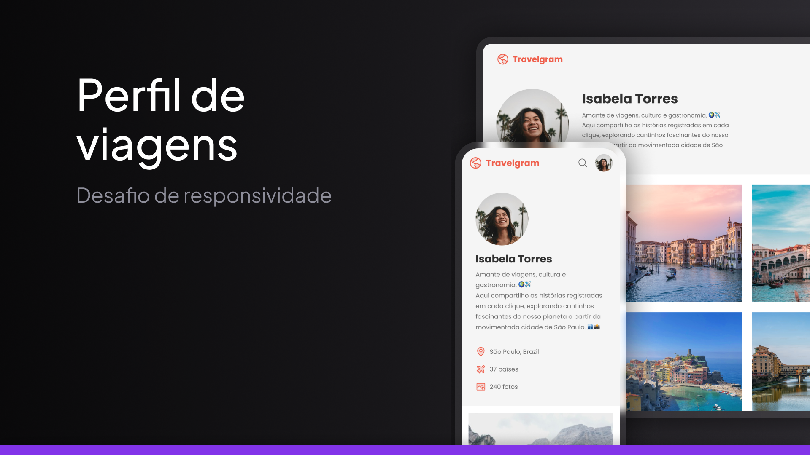

<h1 align="center"> Travelgram </h1>

Uma página sobre uma rede social de viagens fictícia feita como forma de estudos do curso Fullstack da Rocketseat

<a href="https://guilhermedkdk.github.io/page-travelgram-challenge/">🔗 Live Preview</a>&nbsp;&nbsp;&nbsp;|&nbsp;&nbsp;&nbsp;
<a href="#-tecnologias">🚀 Tecnologias</a>&nbsp;&nbsp;&nbsp; |&nbsp;&nbsp;&nbsp;&nbsp;
<a href="#-projeto">💻 Projeto</a>&nbsp;&nbsp;&nbsp;|&nbsp;&nbsp;&nbsp;
<a href="#-aprendizados">📚 Aprendizados</a>

## 🚀 Tecnologias

Esse projeto foi desenvolvido com as seguintes tecnologias:

- HTML e CSS
- Git e Github
- FIGMA

## 💻 Projeto e Desafio

A "Travelgram Page" foi um mini projeto do curso Fullstack da Rocketseat no módulo "Avançando HTML e CSS". Nele, apliquei conceitos avançados de CSS como variáveis, pseudo-classes e pseudo-elementos. Também utilizei Display Flex para organizar itens e eixos, definindo direções, alinhamentos e como desafio tornei ela responsiva para mobile, consolidando os conhecimentos adquiridos nesse módulo.

## 📚 Aprendizados

Este projeto foi feito dentro do curso de Fullstack no módulo "Avançando HTML e CSS" da Rocketseat.
Nele pude consolidar os conhecimentos sobre:

### CSS
- Display Flex
- Variáveis
- Pseudo-classes e pseudo-elements
- Position
- Flex Direction
- Itens e eixos
- Alinhamentos
